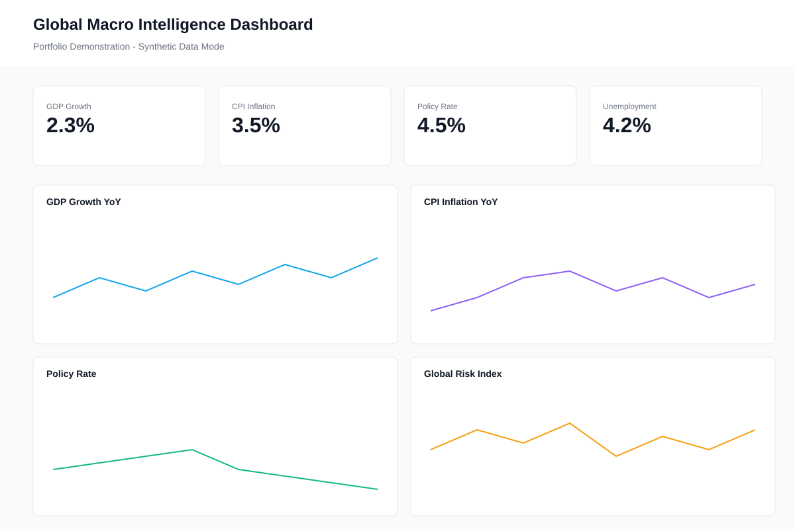

# Global Macro Intelligence Dashboard

A production-quality portfolio repository demonstrating institutional-grade macroeconomic dashboard architecture, data modeling, and visualization systems.



## Overview

This repository showcases advanced dashboard engineering capabilities without exposing proprietary data pipelines or production systems. It features:

- **Clean Data Architecture**: Abstracted data provider interface allowing seamless switching between data sources
- **Synthetic Data Mode**: Realistic time series generation with trends, seasonality, shocks, and regime shifts
- **Production-Ready UI**: Institutional design with comprehensive filtering, KPI cards, and interactive charts
- **Type Safety**: Full TypeScript implementation with Zod schema validation
- **Export Capabilities**: Chart PNG export and dataset JSON download

**Important**: This is a portfolio demonstration. Production data pipelines, proprietary datasets, and API keys are intentionally excluded.

## Architecture

```
┌─────────────────────────────────────────────────────────────┐
│                      Dashboard UI Layer                      │
│  ┌──────────────┐  ┌──────────────┐  ┌──────────────┐      │
│  │  KPI Cards   │  │    Charts    │  │   Filters    │      │
│  └──────────────┘  └──────────────┘  └──────────────┘      │
└─────────────────────────────────────────────────────────────┘
                           │
                           ▼
┌─────────────────────────────────────────────────────────────┐
│                   Data Provider Interface                    │
│     getSeries() | getLatest() | getMetadata()               │
└─────────────────────────────────────────────────────────────┘
           │                              │
           ▼                              ▼
┌──────────────────────┐      ┌──────────────────────┐
│ SyntheticDataProvider│      │  OpenDataProvider    │
│  (Complete)          │      │  (Stub/Template)     │
└──────────────────────┘      └──────────────────────┘
           │
           ▼
┌──────────────────────┐
│ Synthetic Generator  │
│ - Trends             │
│ - Seasonality        │
│ - Shocks             │
│ - Noise              │
└──────────────────────┘
```

## Tech Stack

- **Framework**: React 19 + TypeScript + Vite
- **Styling**: Tailwind CSS
- **Charts**: Recharts
- **State Management**: Zustand
- **Schema Validation**: Zod
- **Export**: html2canvas

## Quick Start

```bash
# Install dependencies
npm install

# Run development server
npm run dev

# Build for production
npm run build

# Preview production build
npm run preview
```

The application will start at `http://localhost:5173` in synthetic data mode.

## Folder Structure

```
jf-global-macro-intelligence/
├── src/
│   ├── app/                      # Application configuration
│   ├── components/               # Reusable UI components
│   │   ├── charts/              # Chart components
│   │   │   ├── ChartContainer.tsx
│   │   │   └── LineChart.tsx
│   │   ├── layout/              # Layout components
│   │   │   ├── AppLayout.tsx
│   │   │   ├── Sidebar.tsx
│   │   │   ├── TopBar.tsx
│   │   │   └── MethodologyDrawer.tsx
│   │   ├── ErrorBoundary.tsx
│   │   └── KPICard.tsx
│   ├── data/                    # Data layer
│   │   ├── adapters/            # Data provider implementations
│   │   │   ├── index.ts         # Provider factory
│   │   │   ├── SyntheticDataProvider.ts
│   │   │   └── OpenDataProvider.ts
│   │   └── synthetic/           # Synthetic data generation
│   │       ├── generator.ts
│   │       └── macroMetrics.ts
│   ├── domains/                 # Domain-specific logic
│   │   └── macro/
│   ├── hooks/                   # Custom React hooks
│   │   └── useData.ts
│   ├── lib/                     # Utilities and helpers
│   │   ├── chartExport.ts
│   │   └── store.ts
│   ├── models/                  # TypeScript types and Zod schemas
│   │   └── timeseries.ts
│   ├── pages/                   # Page components
│   │   └── Dashboard.tsx
│   └── styles/                  # Global styles
├── data/                        # Static data files
│   ├── synthetic/
│   └── examples/
├── docs/                        # Documentation
│   ├── ARCHITECTURE.md
│   ├── METRICS.md
│   └── SECURITY.md
├── public/                      # Static assets
│   └── screenshots/
└── package.json
```

## Data Modes

### Synthetic Mode (Default)

Set in `.env`:
```
VITE_DATA_MODE=synthetic
```

Uses the `SyntheticDataProvider` to generate realistic macroeconomic time series data with:
- Configurable trends and growth rates
- Seasonal patterns
- Shock events (e.g., pandemic, financial crisis)
- Regime shifts (e.g., monetary policy changes)
- Statistical noise

### Open Data Mode (Template)

Set in `.env`:
```
VITE_DATA_MODE=open
VITE_OPEN_DATA_API_KEY=your_key_here  # Optional, depending on source
```

The `OpenDataProvider` is a stub demonstrating how to connect to public data sources like:
- FRED (Federal Reserve Economic Data) - no key required
- World Bank Open Data API
- IMF Data API
- OECD Data API

See `src/data/adapters/OpenDataProvider.ts` for implementation guidance.

## Metrics

The dashboard tracks 8 core macroeconomic indicators:

1. **GDP Growth YoY** - Real GDP growth rate (%)
2. **CPI Inflation YoY** - Consumer price inflation (%)
3. **Policy Rate** - Central bank benchmark rate (%)
4. **Unemployment Rate** - Unemployment as % of labor force
5. **Debt to GDP** - Government debt ratio (%)
6. **Trade Balance** - Net exports (USD Bn)
7. **Currency Index** - Trade-weighted FX index
8. **Global Risk Index** - Composite risk measure

See [docs/METRICS.md](./docs/METRICS.md) for detailed definitions.

## Features

### Interactive Dashboard
- Real-time filtering by date range and geography
- 4 headline KPI cards
- 8 time series charts with tooltips
- Responsive grid layout

### Data Export
- Export individual charts as PNG
- Download complete synthetic dataset as JSON
- Methodology documentation drawer

### Engineering Quality
- TypeScript strict mode
- Zod schema validation for all data
- Error boundaries and loading states
- Reusable chart components
- Clean separation of concerns

## Development

### Adding a New Metric

1. Define metadata in `src/data/synthetic/macroMetrics.ts`:
```typescript
export const METRICS_METADATA = {
  my_metric: {
    metric_id: 'my_metric',
    label: 'My Metric',
    description: 'Description of the metric',
    unit: '%',
    frequency: 'monthly',
    source_type: 'synthetic',
  },
  // ...
};
```

2. Generate synthetic data:
```typescript
export function generateMacroMetrics() {
  const generator = new SyntheticDataGenerator({
    startDate: START_DATE,
    endDate: END_DATE,
    frequency: 'monthly',
    baseValue: 100,
    trend: 0.1,
    seasonalAmplitude: 5,
  });
  
  metrics.my_metric = {
    metric_id: 'my_metric',
    label: 'My Metric',
    unit: '%',
    frequency: 'monthly',
    observations: generator.generate(),
  };
}
```

3. Add chart to dashboard in `src/pages/Dashboard.tsx`

### Testing

```bash
# Run linter
npm run lint

# Type check
npm run build
```

## Customization

### Brand Colors

Edit `tailwind.config.js`:
```javascript
theme: {
  extend: {
    colors: {
      primary: {
        500: '#your-color',
        600: '#your-darker-color',
        // ...
      },
    },
  },
}
```

### Typography

Update `src/index.css` with your preferred font stack.

### Adding Open Data Adapter

1. Implement methods in `src/data/adapters/OpenDataProvider.ts`
2. Add API configuration to `.env`
3. Map metric IDs to external source identifiers
4. Transform external data format to `TimeSeries` schema
5. Validate with Zod before returning

Example:
```typescript
async getSeries(metricId: string): Promise<TimeSeries> {
  const externalId = METRIC_MAPPING[metricId];
  const response = await fetch(`https://api.example.com/series/${externalId}`);
  const data = await response.json();
  
  const timeSeries: TimeSeries = {
    metric_id: metricId,
    label: data.name,
    unit: data.unit,
    frequency: 'monthly',
    observations: data.values.map(v => ({
      date: v.date,
      value: v.value,
    })),
  };
  
  return TimeSeriesSchema.parse(timeSeries); // Validate
}
```

## Security

- ✅ No API keys committed
- ✅ No production endpoints
- ✅ No database credentials
- ✅ No proprietary data
- ✅ Environment variables in `.gitignore`

See [docs/SECURITY.md](./docs/SECURITY.md) for details.

## License

MIT License - see [LICENSE](./LICENSE) file for details.

## Author

Jasmine Fosque

---

**Portfolio Note**: This repository demonstrates dashboard architecture, data modeling, and visualization engineering. Production data pipelines and proprietary datasets are intentionally excluded to protect intellectual property while showcasing technical capability.
